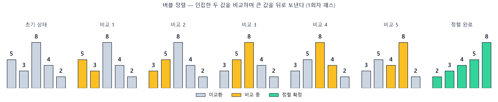
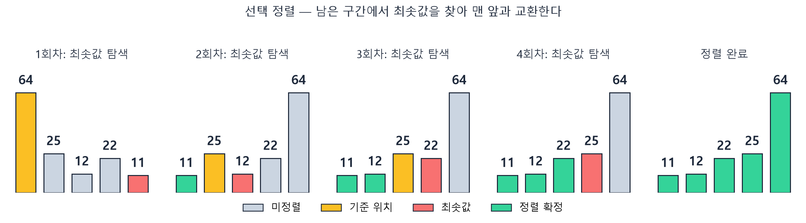
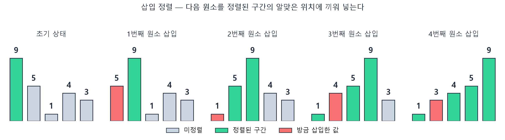
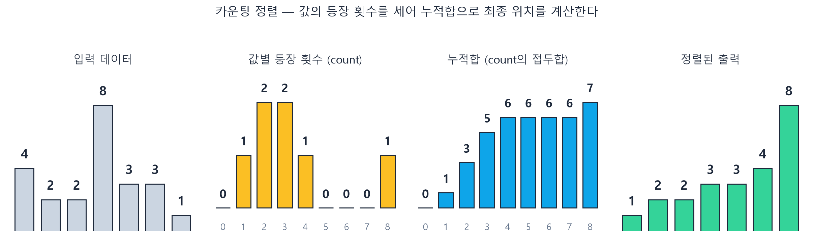
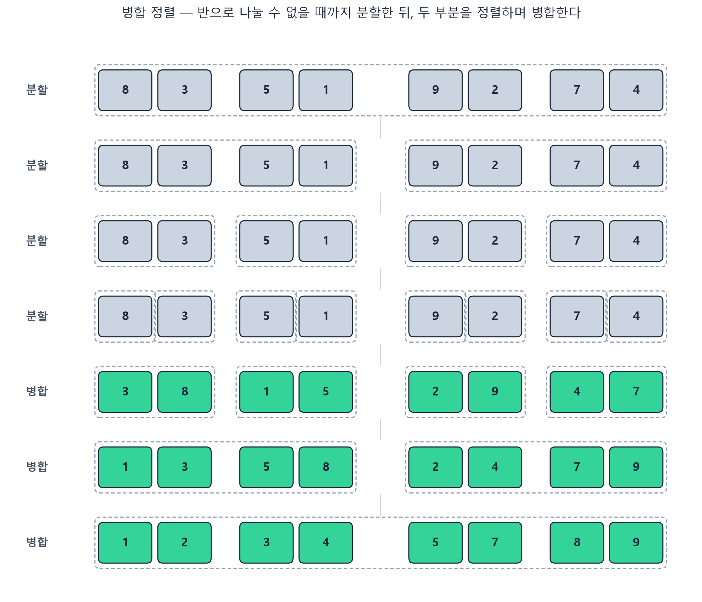
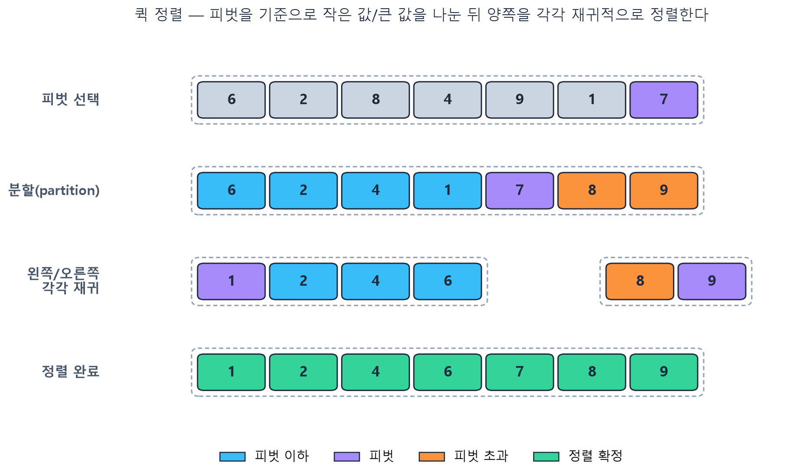
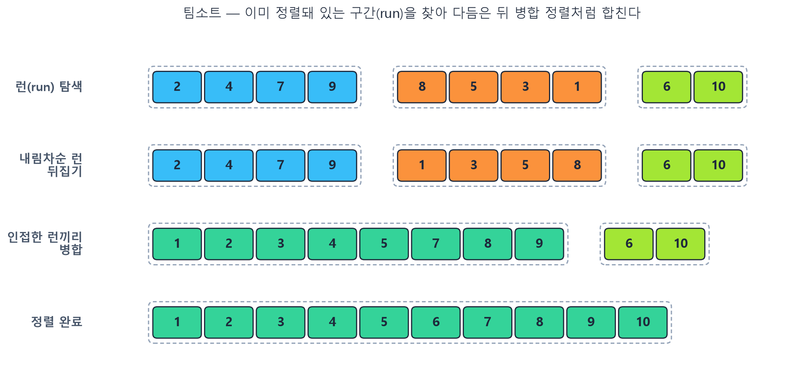

## 정렬이란

2개 이상의 자료를 특정 기준(크기, 문자열 등)에 따라 오름차순 또는 내림차순으로 재배열하는 것.

정렬 알고리즘을 비교할 때 보는 기준은 크게 네 가지다.

- **시간 복잡도**: 데이터 개수 `n`이 늘어날 때 비교/교환 횟수가 어떻게 늘어나는가
- **공간 복잡도**: 정렬을 위해 원본 배열 외에 추가 메모리가 얼마나 필요한가
- **안정성(Stability)**: 값이 같은 원소들의 상대적 순서가 정렬 후에도 유지되는가
- **제자리 정렬(In-place)**: 입력 배열 자체를 O(1)~O(log n) 수준의 추가 공간만으로 정렬할 수 있는가

아래 버블/선택/삽입/카운팅 정렬은 구현이 단순해서 정렬의 원리를 익히기 좋고, 뒤에서 다루는 병합/퀵/팀소트는 실제 언어/라이브러리의 기본 정렬로 쓰이는 알고리즘들이다.

## 버블 정렬 (Bubble Sort)

인접한 두 원소를 비교해서, 앞이 뒤보다 크면 서로 교환하는 방식. 한 번 순회(패스)할 때마다 가장 큰 값이 물거품처럼 뒤로 밀려나서 붙는다.

- 배열 처음부터 끝까지 인접한 두 값을 계속 비교하며 순회한다.
- 비교한 두 값 중 앞이 더 크면 교환한다.
- 한 패스가 끝나면 맨 뒤 원소는 정렬이 확정된다. 다음 패스는 그 앞까지만 반복한다.



```python
def bubble_sort(arr):
    n = len(arr)
    for i in range(n):
        swapped = False
        for j in range(n - i - 1):
            if arr[j] > arr[j + 1]:
                arr[j], arr[j + 1] = arr[j + 1], arr[j]
                swapped = True
        if not swapped:  # 이번 패스에서 교환이 없었다면 이미 정렬 완료
            break
    return arr
```

- **시간 복잡도**: 평균/최악 O(n²), 이미 정렬된 배열이면 한 패스만 돌고 끝나므로 최선 O(n)
- **공간 복잡도**: O(1), 안정 정렬(O), 제자리 정렬(O)
- 구현이 가장 쉽고 원리를 이해하기 좋지만, 실전에서 그대로 쓰기엔 느리다.

## 선택 정렬 (Selection Sort)

아직 정렬되지 않은 구간에서 최솟값을 찾아, 그 구간의 맨 앞과 자리를 바꾸는 방식. "가장 작은 카드를 골라서 맨 앞에 놓는다"는 직관 그대로다.

- 정렬 안 된 구간 전체를 훑어 최솟값의 위치를 찾는다.
- 그 최솟값을 구간의 맨 앞 원소와 교환한다.
- 정렬된 구간이 하나씩 늘어나며, 정렬 안 된 구간이 하나씩 줄어든다.



```python
def selection_sort(arr):
    n = len(arr)
    for i in range(n - 1):
        min_idx = i
        for j in range(i + 1, n):
            if arr[j] < arr[min_idx]:
                min_idx = j
        arr[i], arr[min_idx] = arr[min_idx], arr[i]
    return arr
```

- **시간 복잡도**: 이미 정렬돼 있어도 매번 남은 구간 전체를 훑어야 하므로 최선/평균/최악 모두 O(n²)
- **공간 복잡도**: O(1), 안정 정렬(X, 교환 과정에서 같은 값의 순서가 바뀔 수 있음), 제자리 정렬(O)
- 교환 횟수가 최대 n-1번으로 버블 정렬보다 적어서, 교환 비용이 비교 비용보다 클 때 유리하다.

## 삽입 정렬 (Insertion Sort)

리스트를 정렬된 부분집합 `S`와 미정렬 부분집합 `U`로 나눈다고 생각하고, `U`의 맨 앞 원소를 하나씩 꺼내 `S`의 알맞은 위치에 끼워 넣는 방식. 카드 게임에서 손에 들어온 카드를 정렬된 자리에 꽂아 넣는 것과 같다.

- 두 번째 원소부터 시작해서, 그 값을 `key`로 삼는다.
- `key`보다 큰 값들을 뒤로 한 칸씩 밀어낸다.
- 밀려나지 않는 위치(= `key`보다 작거나 같은 값 바로 뒤)에 `key`를 삽입한다.



```python
def insertion_sort(arr):
    for i in range(1, len(arr)):
        key = arr[i]
        j = i - 1
        while j >= 0 and arr[j] > key:
            arr[j + 1] = arr[j]
            j -= 1
        arr[j + 1] = key
    return arr
```

- **시간 복잡도**: 평균/최악 O(n²), 이미 정렬된 배열이면 비교만 하고 이동이 없어 최선 O(n)
- **공간 복잡도**: O(1), 안정 정렬(O), 제자리 정렬(O)
- 데이터가 거의 정렬돼 있거나 데이터 수가 적을 때는 다른 O(n log n) 알고리즘보다도 빠른 경우가 많다. 뒤에서 볼 팀소트가 작은 구간을 삽입 정렬로 처리하는 이유이기도 하다.

## 카운팅 정렬 (Counting Sort)

비교 없이 정렬하는 알고리즘. 값의 등장 횟수를 세어(count), 그 누적합으로 각 값이 결과 배열에서 위치할 자리를 바로 계산해버린다. 값의 범위(k)가 좁고, 데이터 수(n)가 많을 때 유용하다.

1. 데이터에 등장하는 값 0~k까지 각각 몇 번 나왔는지 센다(`count` 배열).
2. `count` 배열을 누적합으로 바꾼다 — `count[i]`는 "값이 i 이하인 원소가 몇 개인가"가 된다.
3. 원본 배열을 뒤에서부터 순회하며, 각 값을 `count`가 가리키는 위치에 놓고 `count`를 하나 줄인다. 뒤에서부터 순회해야 같은 값이 여러 개일 때 상대 순서가 유지된다(안정 정렬).



```python
def counting_sort(arr, max_value):
    count = [0] * (max_value + 1)
    for num in arr:
        count[num] += 1
    for i in range(1, max_value + 1):
        count[i] += count[i - 1]

    result = [0] * len(arr)
    for num in reversed(arr):
        count[num] -= 1
        result[count[num]] = num
    return result
```

- **시간 복잡도**: 최선/평균/최악 모두 O(n + k) — n이 아무리 커도 k(값의 범위)가 작으면 매우 빠르다.
- **공간 복잡도**: O(n + k), 안정 정렬(O), 제자리 정렬(X, count/result 배열이 추가로 필요)
- 정수처럼 값의 범위가 명확하고 좁을 때만 쓸 수 있고, k가 n보다 훨씬 크면 오히려 손해다.

## 병합 정렬 (Merge Sort)

여기서부터는 위 슬라이드 자료에는 없던, 실제 서비스/언어에서 쓰이는 정렬을 온라인 레퍼런스로 정리했다.

분할 정복(Divide and Conquer) 알고리즘. 배열을 더 이상 나눌 수 없을 때까지 반으로 쪼갠 뒤, 정렬된 두 부분을 순서대로 비교하며 하나로 합친다.

- **분할**: 배열을 반으로 나누는 걸 원소가 하나 남을 때까지 재귀적으로 반복한다.
- **병합**: 크기 1짜리(이미 정렬된 것과 같음) 배열들을, 두 포인터로 값을 비교하며 정렬된 상태로 합쳐 나간다. 이 병합을 반으로 나눴던 순서의 역순으로 최상위까지 반복하면 전체가 정렬된다.



```python
def merge_sort(arr):
    if len(arr) <= 1:
        return arr

    mid = len(arr) // 2
    left = merge_sort(arr[:mid])
    right = merge_sort(arr[mid:])

    result, i, j = [], 0, 0
    while i < len(left) and j < len(right):
        if left[i] <= right[j]:
            result.append(left[i]); i += 1
        else:
            result.append(right[j]); j += 1
    result.extend(left[i:])
    result.extend(right[j:])
    return result
```

- **시간 복잡도**: 데이터 분포와 상관없이 항상 O(n log n) — 언제나 정확히 반으로 나누기 때문에 최선/평균/최악이 동일하다.
- **공간 복잡도**: O(n) — 병합 과정에 임시 배열이 필요해 제자리 정렬이 아니다.
- **안정 정렬(O)** — 왼쪽 값이 오른쪽 값과 같을 때 왼쪽을 먼저 넣도록만 구현하면 순서가 보존된다.
- 연결 리스트처럼 임의 접근이 느린 자료구조에 특히 유리하고, 여러 조각을 독립적으로 정렬 후 병합할 수 있어 병렬화·외부 정렬(external sort)에도 잘 맞는다.

## 퀵 정렬 (Quick Sort)

역시 분할 정복 알고리즘이지만, 병합 정렬과 반대로 "나눌 때" 정렬 작업 대부분이 끝난다. 기준값(pivot)을 하나 고르고, 그보다 작은 값은 왼쪽, 큰 값은 오른쪽으로 몰아넣는 분할(partition) 과정을 반복한다.

1. 배열에서 피벗을 하나 고른다(마지막 원소, 첫 원소, 중앙값 등 전략은 다양하다).
2. 피벗보다 작거나 같은 값은 왼쪽으로, 큰 값은 오른쪽으로 모으면서 피벗을 자기 자리에 놓는다(분할).
3. 분할된 왼쪽/오른쪽 부분 배열에 대해 같은 과정을 재귀적으로 반복한다.



```python
def quick_sort(arr, low=0, high=None):
    if high is None:
        high = len(arr) - 1
    if low < high:
        p = partition(arr, low, high)
        quick_sort(arr, low, p - 1)
        quick_sort(arr, p + 1, high)
    return arr


def partition(arr, low, high):
    pivot = arr[high]
    i = low - 1
    for j in range(low, high):
        if arr[j] <= pivot:
            i += 1
            arr[i], arr[j] = arr[j], arr[i]
    arr[i + 1], arr[high] = arr[high], arr[i + 1]
    return i + 1
```

- **시간 복잡도**: 평균 O(n log n)이지만, 피벗이 매번 최솟값/최댓값으로 뽑히는 최악의 경우(이미 정렬된 배열 + 항상 마지막 원소를 피벗으로 고르는 구현 등) O(n²)까지 나빠질 수 있다. 랜덤 피벗이나 median-of-three 같은 전략으로 이 확률을 크게 낮춘다.
- **공간 복잡도**: 재귀 호출 스택으로 평균 O(log n)
- **안정 정렬(X)** — 파티션 과정에서 같은 값의 상대 순서가 바뀔 수 있다. **제자리 정렬(O)**
- 평균적으로 상수 계수가 작고 캐시 지역성이 좋아서, 실무에서는 병합 정렬보다 빠른 경우가 많다. 다만 안정성이 필요 없고 최악의 경우를 어느 정도 감수할 수 있는 상황에 적합하다.

## 팀소트 (Timsort)

병합 정렬과 삽입 정렬을 결합한 하이브리드 정렬 알고리즘. 2002년 Tim Peters가 Python을 위해 설계했고, 지금은 Python(`list.sort`, `sorted`)과 Java(객체 배열 `Arrays.sort`), V8(Node.js/Chrome)의 기본 정렬로 쓰인다. 무작위 데이터보다 "일부만 섞인" 실제 데이터에서 특히 강하다.

1. **런(run) 탐색**: 배열을 앞에서부터 훑으며 이미 오름차순/내림차순으로 정렬된 구간(run)을 찾는다. 내림차순 run은 통째로 뒤집어 오름차순으로 만든다.
2. **짧은 run 보정**: run이 최소 길이(minrun, 보통 32~64)보다 짧으면, 삽입 정렬로 그 구간을 minrun 길이까지 확장해서 정렬한다. 삽입 정렬은 데이터가 적거나 거의 정렬돼 있을 때 매우 빠르기 때문이다.
3. **런 병합**: 정리된 run들을 병합 정렬과 같은 방식으로 두 개씩 짝지어 병합해 나간다. 병합 순서는 스택 크기가 한쪽으로 치우치지 않도록 관리해서, 병합 비용이 늘어나지 않게 조절한다.



- **시간 복잡도**: 평균/최악 O(n log n), 배열이 이미 정렬돼 있거나 몇 개의 정렬된 run으로만 이루어져 있으면 최선 O(n)까지 내려간다.
- **공간 복잡도**: O(n), **안정 정렬(O)** — 병합 정렬 기반이라 안정성이 보장된다.
- 병합 정렬의 안정성 + 삽입 정렬의 "거의 정렬된 데이터에 강함"을 합친 알고리즘. 그 대가로 구현이 가장 복잡하다 — 실제 CPython 구현은 minrun 계산, 병합 스택 불변식(merge invariant), 갤로핑(galloping) 모드 등 세부 최적화가 많다.

## 정렬 알고리즘 비교

| 알고리즘 | 최선 | 평균 | 최악 | 공간 | 안정 | 제자리 |
| --- | --- | --- | --- | --- | --- | --- |
| 버블 정렬 | O(n) | O(n²) | O(n²) | O(1) | O | O |
| 선택 정렬 | O(n²) | O(n²) | O(n²) | O(1) | X | O |
| 삽입 정렬 | O(n) | O(n²) | O(n²) | O(1) | O | O |
| 카운팅 정렬 | O(n+k) | O(n+k) | O(n+k) | O(n+k) | O | X |
| 병합 정렬 | O(n log n) | O(n log n) | O(n log n) | O(n) | O | X |
| 퀵 정렬 | O(n log n) | O(n log n) | O(n²) | O(log n) | X | O |
| 팀소트 | O(n) | O(n log n) | O(n log n) | O(n) | O | X |

정리하면:

- **원리를 익힐 때**: 버블 → 선택 → 삽입 순으로 보면 "비교/교환을 어떻게 줄여나가는가"의 흐름이 자연스럽게 이어진다.
- **값의 범위가 좁은 정수 데이터**: 카운팅 정렬이 O(n)에 가깝게 가장 빠르다.
- **안정성이 필요하고 최악의 경우도 보장돼야 할 때**: 병합 정렬.
- **평균적으로 가장 빠른 범용 정렬이 필요할 때**: 퀵 정렬(단, 최악의 경우 대비 필요).
- **실무 언어의 기본 정렬**: 대부분 팀소트류(또는 인트로소트 등 유사한 하이브리드)를 쓴다. "이미 정렬된 데이터가 많이 섞여 있다"는 현실적인 가정 위에서 설계됐기 때문이다.

## 참고 자료

- [Merge Sort - GeeksforGeeks](https://www.geeksforgeeks.org/dsa/merge-sort/)
- [Quick Sort - GeeksforGeeks](https://www.geeksforgeeks.org/dsa/quick-sort-algorithm/)
- [TimSort - GeeksforGeeks](https://www.geeksforgeeks.org/dsa/timsort/)
- [Tim Peters (software engineer) - Wikipedia](https://en.wikipedia.org/wiki/Tim_Peters_(software_engineer))
- [cpython/Objects/listsort.txt - Timsort 원 설계 문서](https://github.com/python/cpython/blob/main/Objects/listsort.txt)
